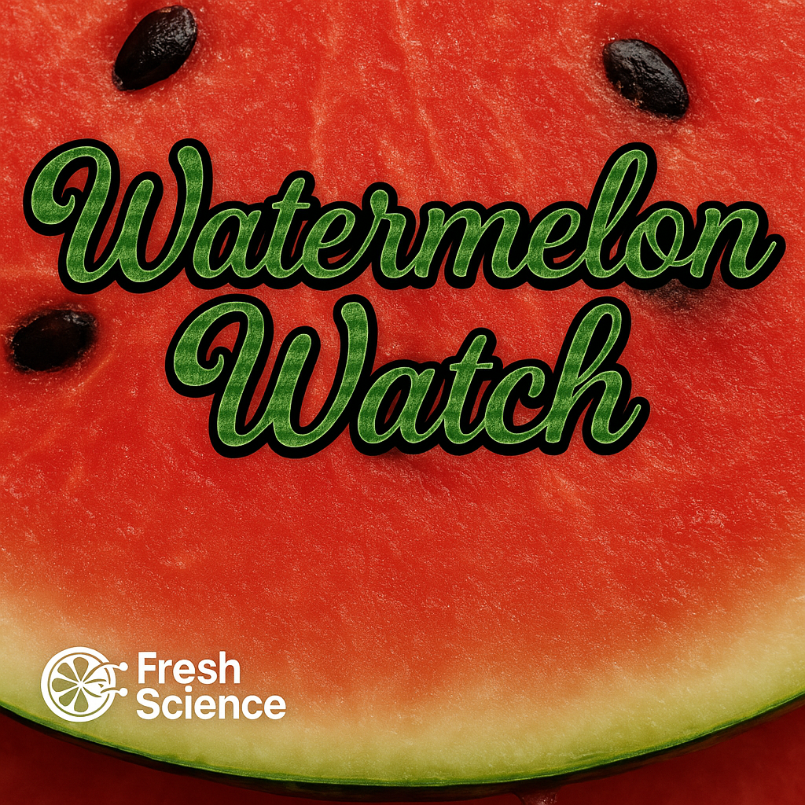

# 🍉 WatermelonWatch

**Smart AI-based tool to forecast watermelon sales using weather and strawberry seasonality.**  
Developed by [Fresh Science](https://github.com/FreshScience) to help fresh produce businesses optimize their stock planning.

---

## 🚀 What does it do?

WatermelonWatch simulates weather and seasonality to provide a simple recommendation:

- ✅ Keep current stock
- 🔥 Increase watermelon orders
- ❄️ Reduce inventory due to low temperature
- 🍓 Watch out for strawberry season!

---

## 💡 Why it matters

In the fresh produce industry, demand can shift dramatically due to temperature changes or seasonal patterns.  
WatermelonWatch provides a lightweight AI logic layer to support real-world business decisions in a visual and intuitive way.

---

## 🛠️ Built With

- [Streamlit](https://streamlit.io/)
- Python (no external APIs, self-contained logic)
- Logic based on:
  - Temperature simulation
  - Strawberry season detection (June–July)

---

## 📸 Screenshot



---

## 👨‍💼 Author

Developed by **Łukasz M.** – Founder of Fresh Science,  
Experienced in trade, distribution, and AI-driven automation.  
Project: https://freshscience-watermelonwatch.streamlit.app *(example)*

---

## 📂 How to run locally

```bash
pip install streamlit
streamlit run watermelonwatch_app.py
```

---

## ✅ Try it live

[https://freshscience-watermelonwatch.streamlit.app](https://freshscience-watermelonwatch.streamlit.app) *(replace with actual link after deploy)*
